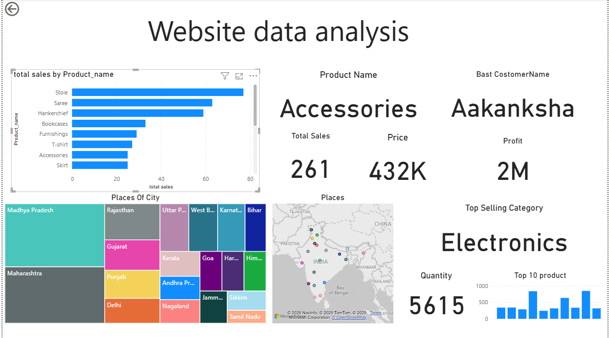

# E-commerce-Sales-Performance-Report


# 🛍️ Project: E-commerce Sales Performance Dashboard
## 🎯 Objective
- **What is the key pain point?**  
  The Sales and Business team wants to monitor and understand the overall sales performance of the online store, including which products and categories are generating the most revenue, and whether monthly sales targets are being met.
- **What is the ideal solution?**  
  A Power BI dashboard that provides:
  -Total revenue
  - Number of orders
  -Average order value
  -Top-selling products
  -Performance vs sales targets
  This dashboard will help decision-makers optimize stock, marketing focus, and set realistic sales goals.
## 👤 User Story
As a **Sales Manager**, I want a dashboard that summarizes the sales performance of the store.  
The dashboard should allow me to:
- Monitor KPIs such as total sales, orders, and top customers.
- Identify the best-selling products and categories.
- Compare actual sales to monthly targets.
- Analyze trends to improve future sales strategies.
With this data, I can make better decisions to improve product offerings and align team efforts with business goals

## 📊 Data Source

- **What data is needed to achieve our objective?**
We need data that includes:
- `Orders.csv`: contains order ID, customer ID, date of purchase, etc.
- `Order_Details.csv`: includes product names, quantities sold, and unit prices.
- `Sales_Target.csv`: monthly sales targets by category or overall.

---

## 🧰 Tools Used

- Power BI (for dashboard creation and interactivity)
- Power Query (for data cleaning and transformation)
- DAX (for KPI calculations)
- Excel / CSV files (as data source)

---

## 📈 Metrics & Visuals

The dashboard includes:
- 📌 **KPI Cards**:
  - Total Sales
  - Total Orders
  - Average Order Value

- 📊 **Visuals**:
  - Line Chart: Monthly Sales Trends
  - Bar Chart: Top 10 Selling Products
  - Pie / Donut Chart: Sales by Category
  - Matrix: Sales vs Target
  - Filters: Category, Country, Date

- 🔍 **Key Measures** (sample DAX):
```dax
Total Sales = SUMX('Order_Details', 'Order_Details'[Quantity] * 'Order_Details'[Unit Price])
Total Quantity = SUM('Order_Details'[Quantity])
Average Order Value = [Total Sales] / DISTINCTCOUNT('Orders'[Order ID])
```
🎨 ## Design
📊 Dashboard Components Required
To understand what the dashboard should contain, let’s break it down based on the questions it answers visually:

What are the total sales and profit generated?

What is the best-selling product and top customer?

Which are the top products by units sold?

What is the top-selling product category?

Which states or regions contributed the most to sales?

How are sales distributed geographically?

These insights help sales and marketing teams quickly identify where revenue is coming from and which products and regions are driving it.

🧪 Dashboard Mockup (Based on Actual Design)
The dashboard was built using Power BI and includes the following components:

✅ KPI Cards / Scorecards

🔹 Name of Best-Selling Product

🔹 Total Units Sold (for selected product)

🔹 Price in Thousands (e.g. 432K)

🔹 Sum of Profit

🔹 Top Customer Name

📊 Bar Chart

Displays total sales by product name to highlight the top-selling items like Stole, Saree, etc.

🧱 Treemap

Visualizes sales volume by state or region (e.g., Maharashtra, Madhya Pradesh), allowing quick identification of high-performing areas.

🗺️ Map Visual

Shows a geographical distribution of sales across India using location data.

🏆 Text Card




🛠️ Tools

| Tool | Purpose |
| --- | --- |
| Excel | Initial data exploration and understanding structure |
| Power BI | Data cleaning, transformation, and creating the interactive dashboard  |
|GitHub	| Hosting the project, documentation, and version control |
|DAX	| Creating calculated measures and KPIs inside Power BI | 


🧪 Development
📋 Pseudocode (Approach Step-by-Step)
Collect the Data

Import datasets: Orders.csv, Order_Details.csv, Sales_Target.csv

Explore the Data in Excel

Check file structure, formats, missing values, column types

Load the Data into Power BI

Use Power Query to connect to all source files

Clean and Transform the Data

Rename headers, remove nulls, fix data types, create relationships

Create Measures Using DAX

Total Sales, Total Orders, Avg. Order Value, etc.

Design the Dashboard

Add visuals: bar charts, treemaps, KPIs, map, text cards, etc.

Generate Insights

Highlight best-selling products, top customers, profit performance

Write Documentation

Describe process, tools, business objective, visual logic

Publish to GitHub

Upload .pbix file, README.md, and screenshots

🧾 Data Exploration Notes
This is the stage where we examine the raw data to identify any potential issues or interesting patterns.

🔍 Initial Observations:
The dataset is structured across 2-3 files, including product sales, order details, and targets.

Some product names appear duplicated with case differences or minor typos — these need to be standardized.

Customer names and city names have some inconsistencies (e.g., extra spaces, different spellings).

Some sales values seem unusually high or low — flagged for review.

Not all columns are needed — extra metadata columns were removed before visualization.


Highlights the Top-Selling Category (e.g., Electronics)


